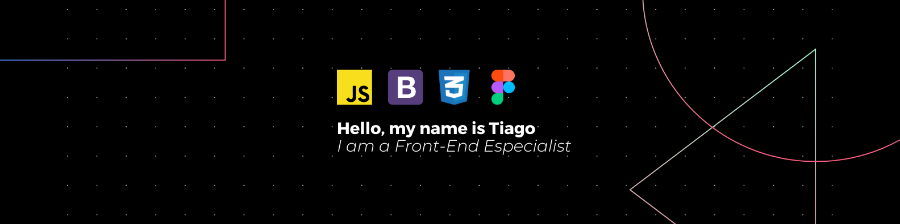

# Hello, folks! 

My name is Jonathan Tiago and I'm a UI and UX Designer, Landing Pages Developer and Front-End Developer. I'm from Brazil, living in Blumenau and currently working at <a href="https://agetex.com.br" target="blank">Agetex</a>. You can find my portfolio at <a href="https://renderiadesign.com.br" target="_blank">renderiadesign.com.br</a>.

## 🔧 Technologies

These are some of the major technologies that I use or have worked on in the past:

 

## 🔧 Tools

---

<em>
let's get in touch!
</em>

